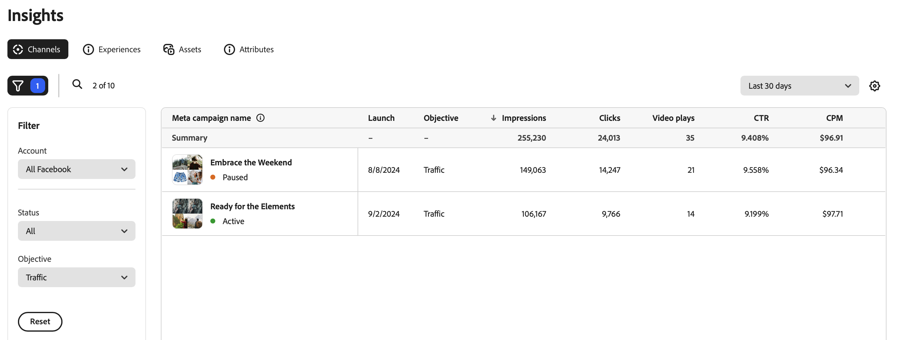

# チャネルの概要

[!DNL Insights]_[!UICONTROL チャネル]_ ビューには、接続されたチャネル広告アカウントのキャンペーンのリストが表示されます。

>[!TIP]
>
>パフォーマンスマーケター向けGenStudioでは、データの受信を開始するためにチャネルアカウントに接続する必要があります。 [ チャネルアカウントの接続 ](connect-channel.md) を参照してください。

[!UICONTROL  チャネル ] テーブルは、チャネルベースの広告キャンペーンを使用して整理されます。 テーブルの左側の上にフィルター（ファネル）アイコンをクリックすると、**[!UICONTROL フィルター]** メニューが開き、[!UICONTROL  アカウント ]、[!UICONTROL  ステータス ]、[!UICONTROL  目的 ] リストから選択して、テーブル内のキャンペーンをフィルタリングできます。

キャンペーンを選択すると、「[[!UICONTROL  エクスペリエンス ]」タブが開き ](experiences.md) そのキャンペーンに関連付けられた広告名のリストが表示されます。ここから、成功に貢献したエクスペリエンスを特定できます。

## 目的

メタ広告を含むキャンペーンを作成した時点で、ビジネス目標に合った目標を選択している可能性があります。 パフォーマンスマーケター向けに、GenStudioに表示されるメタ広告の 6 つの目標があります。

1. **認知**：最大のオーディエンスに働きかけ、ビジネスに認知をもたらします。
1. **トラフィック**：サイトまたはアプリケーションへのトラフィックを増やします。
1. **エンゲージメント**：既存のお客様や潜在的な顧客とやり取りします。
1. **リード**：オーディエンスを拡大するための接続を構築します。
1. **アプリのプロモーション**：アプリケーションをプロモーションします。
1. **販売**：製品を使用する可能性が最も高い人物へのリーチに焦点を当てます。

## 指標

パフォーマンス目標に応じて、インサイト指標は、目標を達成しているかどうかを評価するのに役立ちます。

例えば、認識が目標である場合、認識 `impressions` の上昇は、リーチを拡大していることを示す可能性があります。 それが目的を達成しているかどうかを理解するには、`clicks` や `video plays` など、コンテンツのエンゲージメントを示す指標を調べます。 オーディエンスはコンテンツとどのように効果的にやり取りしているか。

### 指標の詳細

次の表に、チャネル ビューでの主要なデジタルマーケティング指標の定義とインサイトを示します。 各指標には、チャネルに関連する簡単な定義、指標の計算方法、マーケティングキャンペーンに対する重要性と影響を理解するのに役立つ 1 つ以上のインサイトが含まれます。

| 指標 | 定義 | インサイト |
| ----------- | ----------------------------- | -------------------------------- |
| **[!UICONTROL 起動]** | キャンペーンがリリースまたは公開された日付。 | インプレッション数が多い場合は、広告が目的のオーディエンスに到達していることを示している可能性があります。 |
| **[!UICONTROL インプレッション]** | インプレッション数は、インタラクションや表示に関係なく、コンテンツが画面に読み込まれるたびにカウントされます。 | インプレッション数が多い場合は、幅広い可視性を示すことがありますが、真のパフォーマンスインサイトを得るには、他のエンゲージメント指標の使用を検討してください。 |
| **[!UICONTROL クリック数]** | ユーザーがリンクや広告などのクリック可能な要素を操作した回数。 | クリック数が多い場合は、コンテンツに対する強い関心とエンゲージメントを示し、効果的で適切なオーディエンスに届く可能性があります。 |
| **[!UICONTROL CTR]** | 広告、検索結果、メール内のリンクをクリックしたユーザーの割合（%）。 **計算**:`clicks` を `impressions` で割ったもの | クリックスルー率が高い場合は、コンテンツの関連性が高く、メッセージの発信とデザインにオーディエンスに対する動機となり、オーディエンスの関心を効果的にターゲティングしていることを示します。 |
| **[!UICONTROL CPM]** | 広告インプレッション数 1000 件あたりのコスト（$）のパフォーマンス測定。 **計算**：合計金額 `spent` リーチで割り、さらに 1,000 を掛けます | 特に、クリックスルー率が高い場合は、値を小さくすると、コスト効率の高い表示を示す可能性があります。 |
| **[!UICONTROL CPC]** | エクスペリエンスでの各クリックに関連する平均コスト （$）。 **計算**：合計金額 `spent` を `clicks` で割った値 | 平均コストが低いと、特にコンバージョンの増加と比較した場合、コスト効率の高い広告費用が発生する可能性があります。 |
| **[!UICONTROL ビデオ再生]** | ビデオを最後まで視聴した視聴者の割合。 | ビデオ再生の数が多い場合は、ビデオが注目を集めていることを示している可能性があり、サムネール、タイトルまたはプレースメントがビューアで効果的に描画されていることを意味する場合があります。 再生完了率が高い場合は、ビデオコンテンツに説得力があり、関連性があることを示しています。 |
| **[!UICONTROL 予算]** | キャンペーンの目標を達成するために広告キャンペーンに割り当てられた合計資金（$）。 | 予算が大きいほど、より多くのリソースを確保でき、リーチが拡大し、より大きな影響を与える可能性があります。 |
| **[!UICONTROL 費用]** | 指定された期間に予算から費やされた金額。 | 短期間に支出額が多いと、急激な使用が示唆され、リソースの早期枯渇につながる可能性があります。 主要なパフォーマンス指標に対する支出額を追跡し、全体的な ROI を監視するのに役立ちます。 |
